> 원본 URL 주소는 여기에 있습니다. https://wiki.unrealengine.com/Dedicated_Server_Guide_(Windows_%26_Linux)
>
> 오타나 번역 오류 발견 시, GitHub Issue를 통해 알려주시기 바랍니다. 감사합니다.
<hr />
<hr />


# 데디케이티드 서버 가이드(Windows & Linux)

##### 엔진 버전 : 4.14, 4.15, 4.16, 4.17, 4.18

> 참고 -  튜토리얼 비디오의 화질에 대해 사과드립니다. 동영상이 1080p와 알맞은 품질로 녹화되었지만 어떤 이유에서인지 유튜브에 업로드한 뒤로 화질이 깨졌습니다. 최대한 빨리 다시 업로드할 예정입니다. 감사합니다.

<br />

 ### 컨텐츠

**1** [ 세션 1 - 언리얼 엔진 4에서 데디케이티드 서버 빌드하기 ](##-세션-1---언리얼-엔진-4에서-데디케이티드-서버-빌드하기)  

 ​    **1.1** [1. 언리얼 엔진 소스코드 다운받기](####-1.-언리얼-엔진-소스코드-다운받기)

 ​    **1.2** [2. 언리얼 엔진 소스코드 세팅하기](####-2.-언리얼-엔진-소스코드-세팅하기)  

 ​    **1.3** [2.a Visual Studio 2017을 사용하기 위해 언리얼 엔진 소스코드 세팅하기](####-2.a-Visual-Studio-2017을-사용하기-위해-언리얼-엔진-소스코드-세팅하기)

 ​    **1.4** [축하합니다 - 이제 언리얼 엔진 소스코드 빌드 버전을 성공적으로 설정해야 합니다](####-축하합니다---이제-언리얼-엔진-소스코드-빌드-버전을-성공적으로-설정해야-합니다)  

 ​    **1.5** 3. [비디오 가이드(영어)](####-3.-비디오-가이드(영어))  

 **2** [세션 2 - Windows에서 데디케이티드 서버 세팅하기](##세션-2---Windows에서-데디케이티드-서버-세팅하기)  

 ​    **2.1** [1. 새로운 프로젝트의 데디케이티드 서버](####-1.-새로운-프로젝트의-데디케이티드-서버)  

 ​    **2.2** [2. 블루프린트만 있는 프로젝트의 데디케이티드 서버](####-2.-블루프린트만-있는-프로젝트의-데디케이티드-서버)  

​     **2.3** [3. 프로젝트 빌드를 위한 준비](####-3.-프로젝트-빌드를-위한-준비)  

 ​        **2.3.1** [1. 언리얼 엔진 버전 4.14의 타겟 파일 지침](####-1.-언리얼-엔진-버전-4.14의-타겟-파일-지침)  

 ​        **2.3.2** [2. 언리얼 엔진 버전 4.15의 타겟 파일 지침](####-2.-언리얼-엔진-버전-4.15의-타겟-파일-지침)   

 ​        **2.3.3** [3. 언리얼 엔진 버전 4.16의 타겟 파일 지침](####-3.-언리얼-엔진-버전-4.16의-타겟-파일-지침)  

 ​        **2.3.4** [4. 언리얼 엔진 버전 4.17의 타겟 파일 지침](####-4.-언리얼-엔진-버전-4.17의-타겟-파일-지침)  

 ​        **2.3.5** [5. 언리얼 엔진 버전 4.18의 타겟 파일 지침](####-5.-언리얼-엔진-버전-4.18의-타겟-파일-지침)  

 ​    **2.4** [4. 언리얼 엔진 버전 변경 및 프로젝트 파일 생성하기](####-4.-언리얼-엔진-버전-변경-및-프로젝트-파일-생성하기)  

 ​    **2.5** [5. 서버 빌드하기](####-5.-서버-빌드하기)  

 ​    **2.6** [6. 라이팅 스웜 에러 해결하기](####-6.라이팅-스웜-에러-고치기)  

 ​    **2.7** [6.a 비디오 가이드](####-6.a-비디오-가이드)  

 ​    **2.8** [7. 패키징을 위한 프로젝트 준비](####-7.-패키징을-위한-프로젝트-준비)  

 ​    **2.9** [8. 패키징 세팅 설정하기](####-8.-패키징-세팅-설정하기)  

 ​    **2.10** [9. 축하합니다 이제 프로젝트를 패키징했습니다 :D](####-9.-축하합니다-이제-프로젝트를-패키징했습니다-:D)

 **3** [세션 3 - 데디케이티드 서버 실행하고 접속하기](##-세션-3---데디케이티드-서버-실행하고-접속하기)  

 ​    **3.1** [1. 서버 실행파일 복사하기](####-1.-서버-실행파일-복사하기)  

 ​    **3.2** [2. 서버 바로가기 만들고 및 로그 옵션 세팅하기](####-2.-서버-바로가기-만들고-로그-옵션-세팅하기)  

 ​    **3.3** [3. 서버 실행하고 테스트하기](####-3.-서버-실행하고-테스트하기)  

 **4** [세션 4 - 참고할 점](##-세션-4---참고할-점)  

 ​    **4.1** [1. 친구가 인터넷을 통해 접속할 수 있도록 하기](####-1.-친구가-인터넷을-통해-접속할-수-있도록-하기)  

 ​    **4.2** [2. 가상 서버에서 호스팅하기](####-2.-가상-서버에서-호스팅하기)  

 ​    **4.3** 3. 추가 맵 제작 및 다른 맵에 접속하기  

 ​    **4.4** 4. 물리 활성화하기  

 **5** 세션 5 - 편집자와 연락하는 법  

 **6** 세션 6 - 리눅스에서 언리얼 엔진 4 데디케이티드 서버 빌드 및 배치  

​     **6.1** 1. 리눅스 크로스 컴파일을 위해 Visual Studio 설정하기

 ​    **6.2** 2. 프로젝트를 다른 위치에 패키징하기  

 ​    **6.3** 3. 리눅스 바이너리 파일 빌드하기  

 ​    **6.4** 4. 원격 머신에 바이너리 배치하기  

 ​    **6.5** 5. 서버에 접속하고 데디케이티드 서버 바이너리 파일 실행하기  

 ​    **6.6** 6. UDP:7777 열기  

 ​    **6.7** 7. 서버에서 게임 실행하기  

 ​    **6.8** 8. 이슈  

 **7** 세션 7 - 스팀에서 데디케이티드 서버 사용하기  

<br />

## 세션 1 - 언리얼 엔진 4에서 데디케이티드 서버 빌드하기
>독립 실행형 데디케이티드 서버를 구축하는 것은 쉬운 일이 아니었고 많은 사람들이 이 서버와 씨름하고 있다는 것을 알고 있기 때문에 저는 사람들을 돕기 위해 위키 가이드를 만들기로 결심했습니다. 전용 서버의 Windows 실행 파일을 만드는 데 사용한 단계를 살펴보겠습니다.
>
> *원본 wiki 제작자*  

  <br />

#### 1. 언리얼 엔진 소스코드 다운받기

Visual Studio로 서버 솔루션 설정을 빌드하기 위해서 소스 구축 버전이 필요할 것입니다.

엔진을 빌드할 소스는 여기에 있습니다. <https://github.com/EpicGames/UnrealEngine>

> 참고 : 위 링크의 내용을 보려면 먼저 GitHub 계정을 만들고, 언리얼 엔진 계정에 연동시킨 다음 GitHub의 EpicGames 초대를 수락해야 합니다. 그런 다음 링크를 클릭하고 계정에 로그인해야 합니다.
> *(언리얼 엔진 계정에 GitHub 계정을 연동시키는 법에 대한 안내는, [GitHub 의 언리얼 엔진 4](https://www.unrealengine.com/ue4-on-github) 페이지를 참고하세요.)*

다음으로 엔진의 버전을 선택하고 초록색 **Clone or downlad** 버튼을 누릅니다.

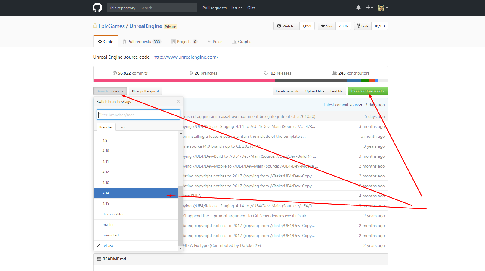

다양한 선택지가 있지만, 저는 항상 .zip 파일만 다운로드 받는 것을 선호합니다.

원하는 위치에 .zip 파일을 추출하고 압축을 풉니다.  

  <br />

#### 2. 언리얼 엔진 소스코드 세팅하기

전에 추출한 폴더를 열고 **Setup.bat** 파일을 찾아서 엽니다.

이 파일을 더블 클릭하면 파일이 콘솔 창으로 열리고 언리얼 엔진 의존 파일들을 설치할 것입니다.

> 참고 : 만약 **.bat** 파일을 열 때 오류가 생긴다면, 우클릭 후 **관리자 권한으로 실행**해 보시기 바랍니다.

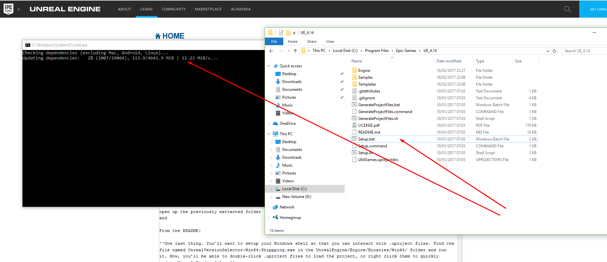

이제 **GenerateProjectFiles.bat** 이라는 파일을 찾습니다.

이 파일을 더블 클릭으로 열지 말고 우클릭 후 **관리자 권한으로 실행**합니다.

작업이 완료되면 폴더에 Visual Studio 솔루션 프로젝트 파일이 생성됩니다.

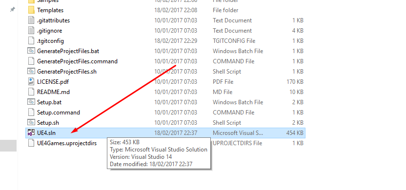

  <br />

#### 2.a Visual Studio 2017을 사용하기 위해 언리얼 엔진 소스코드 세팅하기

여러분이 Visual Studio 2017을 쓰신다면, 위에서 보신 **GenerateProjectFiles.bat** 파일을 클릭하는 대신 CMD 프롬프트 창을 엽니다. **cd** 명령을 사용해 로컬에 저장된 언리얼 파일이 있는 폴더로 이동합니다. 올바른 디렉토리 안으로 들어가면 다음 명령을 실행합니다. `GenerateProjectFiles.bat-2017`

이렇게 하면 Visual Studio 2017 프로젝트 파일을 생성할 것입니다. 자세한 정보는 <https://answers.unrealengine.com/questions/579186/what-about-visual-studio-2017-in-ue4.html> 를 참고하시기 바랍니다.

<hr />

이제 이 솔루션 파일을 열면 Visual Studio가 실행되고 소스 코드를 로딩하기 시작할 것입니다. 

> 참고 : 솔루션을 처음 열었을 때 헤더 파일을 모두 파싱하는 데 보통 시간이 오래 걸립니다. 계속하기 전에 아래에서 완료되었다는 메시지가 뜰 때까지 완전히 끝내도록 가만히 두시기 바랍니다.

다음으로 **win64** 라고 표시된 위치 옆에 있는 드롭다운 메뉴에서 **Development Editor** 를 선택합니다.

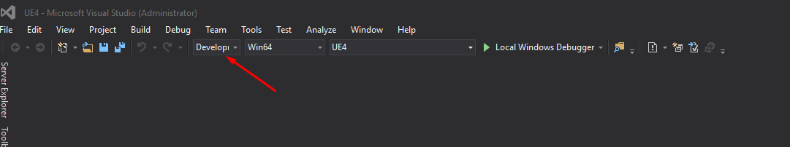

다음으로 솔루션 탐색기로 가서 ue4 프로젝트를 우클릭하고 빌드를 선택합니다.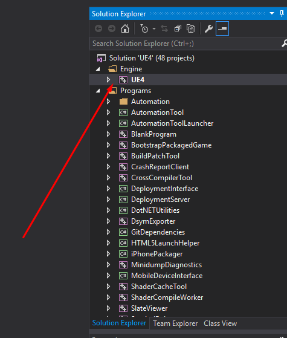

> 참고 : 컴퓨터 사양에 따라 완료하는 데 많은 시간이 걸릴 수 있습니다.

완료되면 솔루션 탐색기에서 ue4 프로젝트 파일을 다시 우클릭하고 **시작 프로젝트로 설정**을 선택합니다.

마지막으로 **로컬 Windows 디버거**로 이동하여 작은 녹색 **플레이 버튼**을 클릭합니다.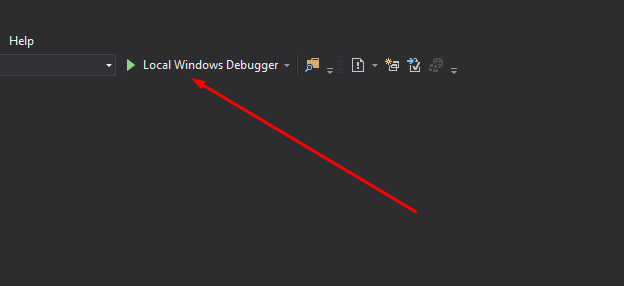

다음과 같은 경고 팝업 창이 나타날 것입니다.

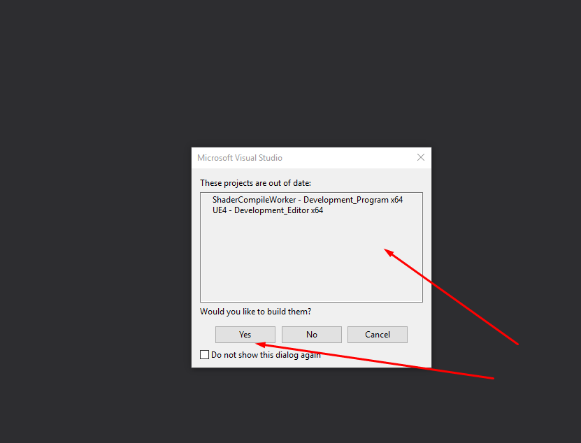

**예** 버튼을 클릭하면 에디터가 열릴 것입니다.

> 참고 : 처음 에디터를 여는 데 다소 시간이 걸릴 수 있으며 프로그램이 정지된 것처럼 일정한 비율로 고정된 것처럼 보일 수 있습니다. 조금만 기다리시면 열릴 것입니다.

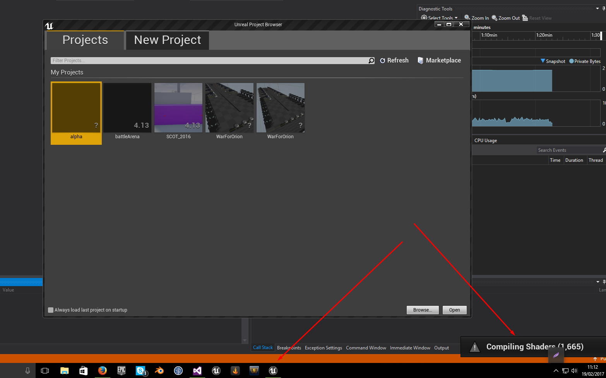

처음 실행할 때에는 모든 셰이더를 컴파일 할 것입니다.

작업 표시줄에 프로그램을 등록하면 Visual Studio를 통하지 않아도 직접 엔진을 열 수 있습니다.

  

#### 축하합니다 - 이제 언리얼 엔진 소스코드 빌드 버전을 성공적으로 설정해야 합니다

#### 3. 비디오 가이드(영어)

<https://www.youtube.com/watch?v=u0jtHK7BdzY&feature=youtu.be>

  <br />

## 세션 2 - Windows에서 데디케이티드 서버 세팅하기

#### 1. 새로운 프로젝트의 데디케이티드 서버

**언리얼 엔진**을 열고, **C++**을 선택한 후 **3인칭** 템플릿을 연 후, 적당한 이름과 저장할 공간을 정합니다.

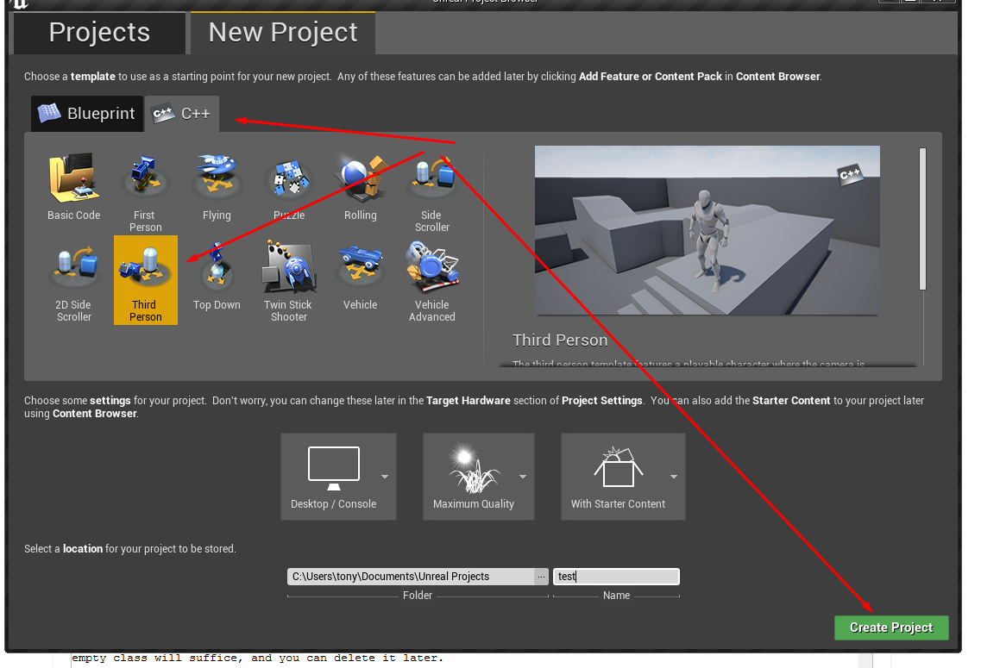

프로젝트와 Visual Studio가 로딩을 완전히 끝냈을 때, 두 프로그램을 모두 닫습니다.

> 참고 : 헤더 파일이 모두 Visual Studio에 파싱될 때까지 기다린 후에 닫으십시오. 저장하라는 메시지가 나타날 수 있습니다.

  <br />

#### 2. 블루프린트만 있는 프로젝트의 데디케이티드 서버

프로젝트가 소스 코드로 만들어지지 않았거나 다른 엔진의 버전 또는 간단히 블루프린트만 있는 경우, C++ 코드를 추가할 때까지 데디케이티드 서버를 만들 수 없습니다.

따라서, C++ 클래스 파일을 새로 추가하기만 하면 됩니다. 빈 클래스만으로도 충분하고, 나중에 삭제할 수 있습니다.

원본 디렉토리가 있으면 **.uproject** 파일을 우클릭하고 Visual Studio 프로젝트 파일을 생성하면 됩니다. 그러면 프로젝트 디렉토리에 Visual Studio로 열 수 있는 **.sln** 파일이 생성됩니다.

  <br />

#### 3. 프로젝트 빌드를 위한 준비

#### 1. 언리얼 엔진 버전 4.14의 타겟 파일 지침

파일 탐색기에서 이전에 만들어 놓은 프로젝트 폴더를 엽니다. **source**라는 폴더가 있을 것입니다. 이 폴더를 엽니다.

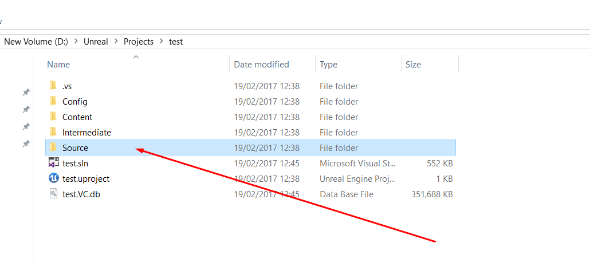

폴더 내부에서 Visual Studio 소스 파일들을 찾을 수 있을 것입니다. 원래 있던 파일 중 하나의 소스 파일을 복사/붙여넣기 하고 다른 파일과 일치하도록 이름을 변경합니다. 형식은 **(gamename)Server.Target.cs** 입니다. 저는 프로젝트 게임 이름을 **test** 로 하고 파일 이름을 **testServer.Target.cs** 로 아래와 같이 했습니다.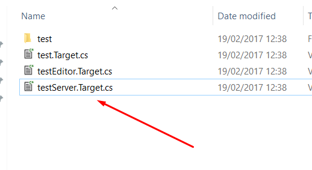

이 새로 만들어진 파일을 우클릭하고 **편집** 버튼을 클릭합니다.
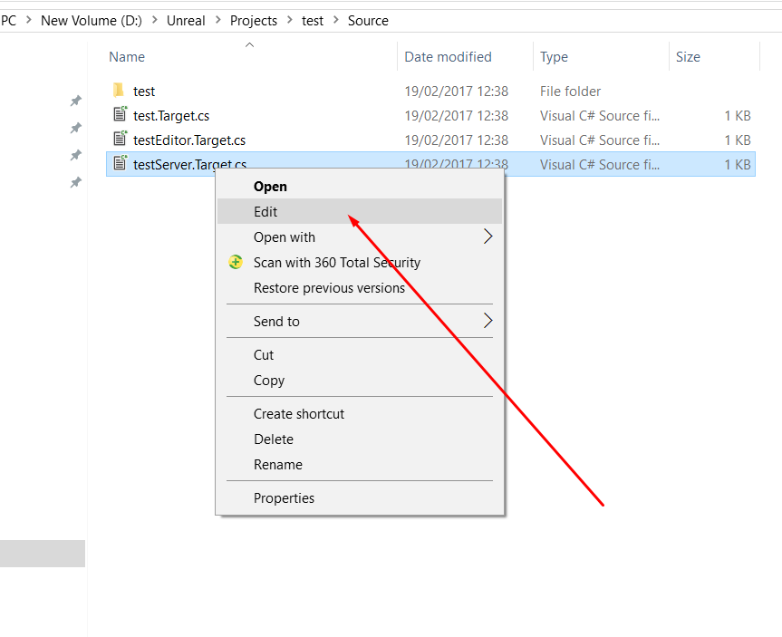

어떤 종류의 텍스트 또는 코드 에디터를 사용할 수 있지만, 일반적으로 메모장으로 열리게 될 것입니다. 메모장으로 하셔도 무방합니다.

파일에 있는 모든 항목을 완전히 비워 두고 이 코드/텍스트로 대체합니다.

```C#
// Copyright 1998-2016 Epic Games, Inc. All Rights Reserved.

using UnrealBuildTool;
using System.Collections.Generic;

public class ShooterGameServerTarget : TargetRules
{
      public ShooterGameServerTarget(TargetInfo Target)
      {
         Type = TargetType.Server;
         bUsesSteam = true;
      }

       //
       // 타겟 룰 인터페이스.
       //

       public override bool GetSupportedPlatforms(ref List<UnrealTargetPlatform> OutPlatforms)
       {
            // 서버 플랫폼에서만 유효합니다.
            return UnrealBuildTool.UnrealBuildTool.GetAllServerPlatforms(ref OutPlatforms, false);
       }

       public override void SetupBinaries
       (
          TargetInfo Target, ref List<UEBuildBinaryConfiguration> OutBuildBinaryConfigurations,
          ref List<string> OutExtraModuleNames
       )
       {
         OutExtraModuleNames.Add("ShooterGame");
       }
}
```

다음으로 3가지의 부분을 변경해야 합니다.

맨 위에 있는 이 줄을 코드를 찾으세요.

```C#
public class ShooterGameServerTarget : TargetRules
```

그리고 자신의 게임 이름으로 변경합니다. 제 경우에는 게임 이름이 **test** 이기 때문에, 코드 라인을 이렇게 변경해야 합니다.

```C#
public class testServerTarget : TargetRules
```

다음으로는 이 코드 라인을 찾아 이전과 동일하게 자신의 게임 이름에 맞게 변경합니다.

```c#
public ShooterGameServerTarget(TargetInfo Target)
```

그리고 다시 자신의 게임 이름으로 바꿉니다. 

```C#
public testServerTarget(TargetInfo Target)
```

마지막으로 이 코드 라인을 찾아 전과 같이 자신의 게임 이름에 맞춰 변경합니다.

```C#
OutExtraModuleNames.Add("ShooterGame");
```

게임 이름을 **test** 로 했기 때문에, 다음과 같이 변경합니다.

```C#
OutExtraModuleNames.Add("test");
```

  <br />

이제 파일을 같은 이름으로 저장하고 닫습니다.

#### 2. 언리얼 엔진 버전 4.15의 타겟 파일 지침

```C#
// Copyright 1998-2017 Epic Games, Inc. All Rights Reserved.

using UnrealBuildTool;
using System.Collections.Generic;

[SupportedPlatforms(UnrealPlatformClass.Server)]
public class ShooterGameServerTarget : TargetRules      // 이전 단계에 표시된 대로 이 코드 라인을 변경합니다.
{
 
    public ShooterGameServerTarget(TargetInfo Target)  // 이전 단계에 표시된 대로 이 코드 라인을 변경합니다.

       {

     Type = TargetType.Server;

      bUsesSteam = false;

       }

        //
        // 타겟 룰 인터페이스.
        //
            public override void SetupBinaries
            (
             TargetInfo Target,
             ref List<UEBuildBinaryConfiguration> OutBuildBinaryConfigurations,
             ref List<string> OutExtraModuleNames
             )
               {
                OutExtraModuleNames.Add("ShooterGame");     // 이전 단계에 표시된 대로 이 코드 라인을 변경합니다.
               }
  }
```

#### 3. 언리얼 엔진 버전 4.16의 타겟 파일 지침

```C#
// Copyright 1998-2017 Epic Games, Inc. All Rights Reserved.

using UnrealBuildTool;
using System.Collections.Generic;

[SupportedPlatforms(UnrealPlatformClass.Server)]
public class ShooterGameServerTarget : TargetRules    // 이전 단계에 표시된 대로 이 코드 라인을 변경합니다.
{
	public ShooterGameServerTarget(TargetInfo Target) : base(Target) // 이전 단계에 표시된 대로 이 코드 라인을 변경합니다.
       {
              Type = TargetType.Server;
              ExtraModuleNames.Add("ShooterGame");   // 이전 단계에 표시된 대로 이 코드 라인을 변경합니다.
       }
}
```

#### 4. 언리얼 엔진 버전 4.17의 타겟 파일 지침

```C#
// Copyright 1998-2017 Epic Games, Inc. All Rights Reserved.

using UnrealBuildTool;
using System.Collections.Generic;

[SupportedPlatforms(UnrealPlatformClass.Server)]
public class ShooterGameServerTarget : TargetRules   // C이전 단계에 표시된 대로 이 코드 라인을 변경합니다.
{
       public ShooterGameServerTarget(TargetInfo Target) : base(Target)  // 이전 단계에 표시된 대로 이 코드 라인을 변경합니다.
       {
        Type = TargetType.Server;
        ExtraModuleNames.Add("ShooterGame");    // 이전 단계에 표시된 대로 이 코드 라인을 변경합니다.
       }
}
```

#### 1. 언리얼 엔진 버전 4.18의 타겟 파일 지침

```C#
// Copyright 1998-2017 Epic Games, Inc. All Rights Reserved.

using UnrealBuildTool;
using System.Collections.Generic;

[SupportedPlatforms(UnrealPlatformClass.Server)]
public class ShooterGameServerTarget : TargetRules   // 이전 단계에 표시된 대로 이 코드 라인을 변경합니다.
{
       public ShooterGameServerTarget(TargetInfo Target) : base(Target)  // 이전 단계에 표시된 대로 이 코드 라인을 변경합니다.
       {
        Type = TargetType.Server;
        ExtraModuleNames.Add("ShooterGame");    // 이전 단계에 표시된 대로 이 코드 라인을 변경합니다.
       }
}
```

<br />

#### 4. 언리얼 엔진 버전 변경 및 프로젝트 파일 생성하기

다음으로 프로젝트 폴더 안에서 .**uproject** 파일을 우클릭하고 팝업 메뉴에서**"언리얼 엔진 버전 변경"** 을 선택합니다.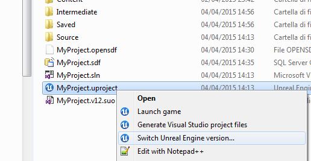

그런 다음 아래의 Readme 파일의 단계를 따릅니다.

> 마지막으로 한 가지, **.uproject** 파일과 상호 작용 할 수 있도록 **Windows shell** 을 설정해야 합니다.
>
> **UnrealEngine/Engine/Binary/Win64/** 폴더에서 **UnrealVersionSelector-Win64-Shipping.exe** 라는 파일을 찾아 실행합니다.
>
> 이제, **.uproject** 파일을 더블클릭하여 프로젝트를 로드하거나 우클릭으로 빠르게 Visual Studio 파일을 빠르게 업데이트할 수 있습니다.
>
> 이제 메뉴를 불러오기 위해 **.uproject** 파일을 우클릭할 수 있게 됩니다.
>
> **엔진 버전 변경** 버튼을 클릭하면 소스 빌드 버전이 드롭다운 메뉴에서 선택되었는지 확인하고 **확인** 을 클릭하면 됩니다.

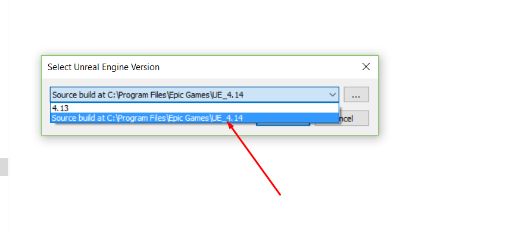

Visual Studio 솔루션 프로젝트 파일을 자동으로 다시 생성할 것입니다. 아무 동작이 없다면, 파일이 이미 업데이트 되었다는 뜻이지만 **.uproject** 파일을 우클릭하고 **"Visual Studio 프로젝트 파일 생성"** 을 하는 것이 안전합니다.

<br />

#### 5. 서버 빌드하기

다음으로 Visual Studio 프로젝트 솔루션을 열고 준비되었다는 메시지가 나올 때까지 완전히 로드되게 합니다.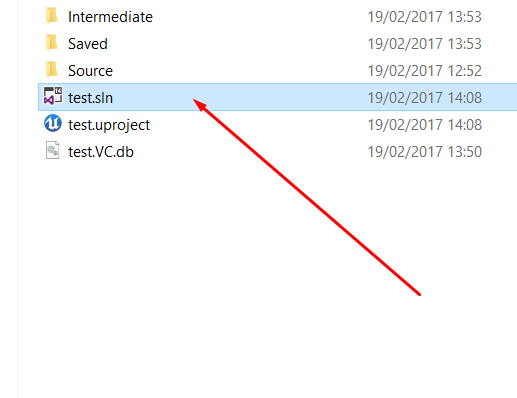

드롭다운 박스로 가서 이번에는 **Development Editor** 를 선택합니다.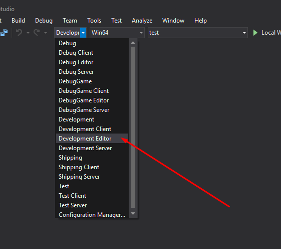

그런 다음 전과 같이 솔루션 탐색기로 가서 우클릭한 후 **빌드** 를 클릭합니다.

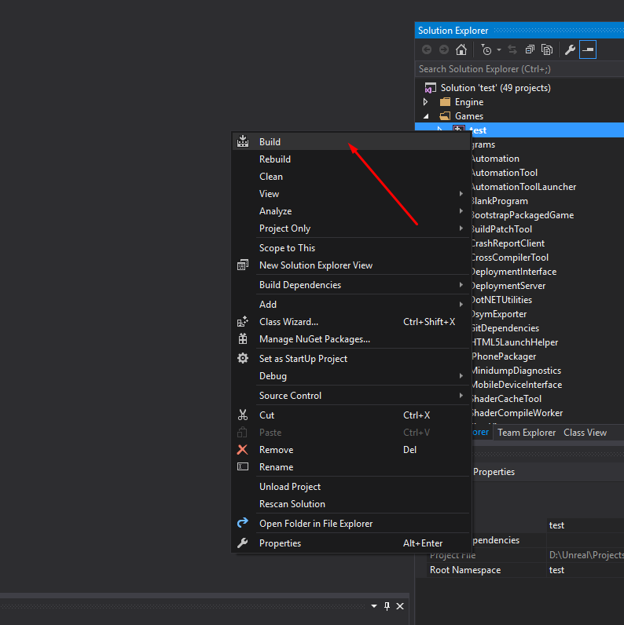

컴퓨터의 성능에 따라 완료하는 데 시간이 걸릴 수 있습니다.

서버가 빌드되면 프로젝트 폴더로 들어가서 **Binaries/Win64** 를 클릭하면 아래와 같은 서버 파일들이 있을 것입니다.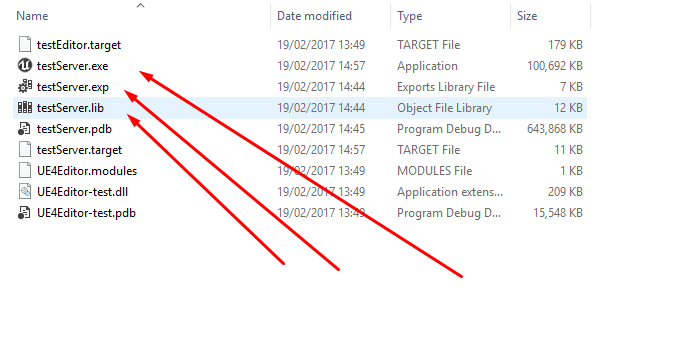

<br />

#### 6. 라이팅 스웜 에러 고치기

빌드된 언리얼 엔진 소스를 사용하면 라이팅 빌드를 할 때 다음 오류가 발생하는 것은 흔한 일이며 저는 해결책을 찾는 데 오랜 시간이 걸렸습니다. 그래서 저는 여러분의 고민을 줄이기 위해 여기에 담았습니다.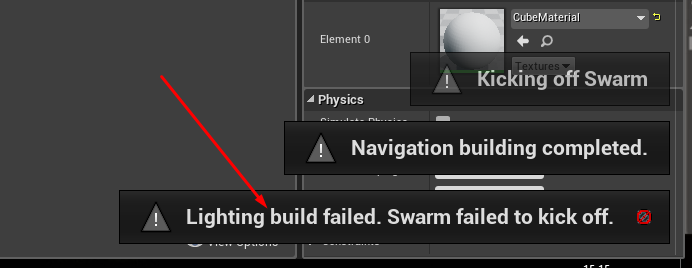

이제 Visual Studio의 솔루션 탐색기에서 **unreal lightmass** 가 보일 때까지 스크롤을 내립니다.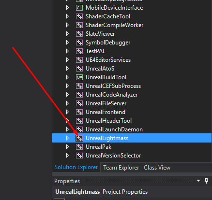

전에 한 것과 같이, 우클릭하고 **빌드** 를 클릭합니다.

빌드가 끝나면 Visual Studio를 닫습니다. 이제 스웜 버그 에러가 고쳐졌을 것입니다.


#### 6.a 비디오 가이드

https://www.youtube.com/watch?v=lkrFFNfjtS0&feature=youtu.be


#### 7. 패키징을 위한 프로젝트 준비

이제 **.uproject** 파일을 다시 클릭해 프로젝트를 엽니다.

가장 먼저 해야 할 일은 컨텐츠 폴더 아래에 **maps**, **blueprints** 라는 새로운 폴더 두 개를 만듭니다.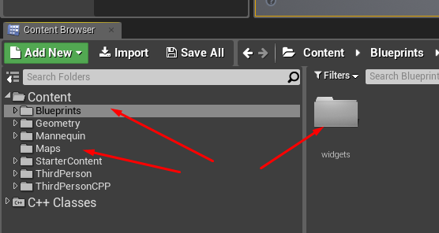

그런 다음 **ThirdPersonExampleMap**이 저장된 곳으로 가서 새로 만든 **maps** 폴더에 다음과 같이 옮깁니다.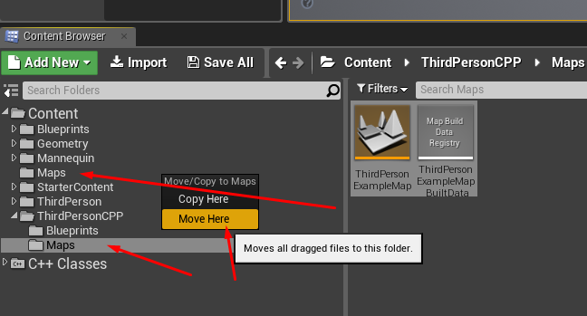

이 레벨을 **TestLevel** 또는 다른 이름으로 변경합니다. 이 레벨은 서버에 플레이어를 서버에 로드하고 게임을 플레이하게 할 것입니다.

엔진 버전이 4.14 이상이라면 새로운 맵을 만들 때 레벨을 반드시 열고 빌드를 클릭해  올바른 **mapBuildDataRegistry** 파일을 생성해야 합니다. 이 작업이 모두 완료되면 **모두 저장** 을 클릭합니다.

이제 추가적으로 2개의 레벨을 생성합니다. 그런 다음, 컨텐츠 브라우저에서 빈 레벨을 선택합니다. 첫 번째 레벨의 이름을 **EntryMap** 으로, 두 번째 레벨의 이름은 **TransitionMap** 으로 다음과 같이 변경합니다.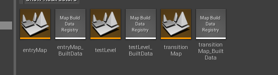

데이터가 올바르게 저장되었는지 확인하기 위해 새 레벨에 매번 빌드하는 것을 잊지 마시기 바랍니다.

**EntryMap** 레벨을 열고 **블루프린트 -> 레벨 블루 프린트 열기** 를 클릭합니다.

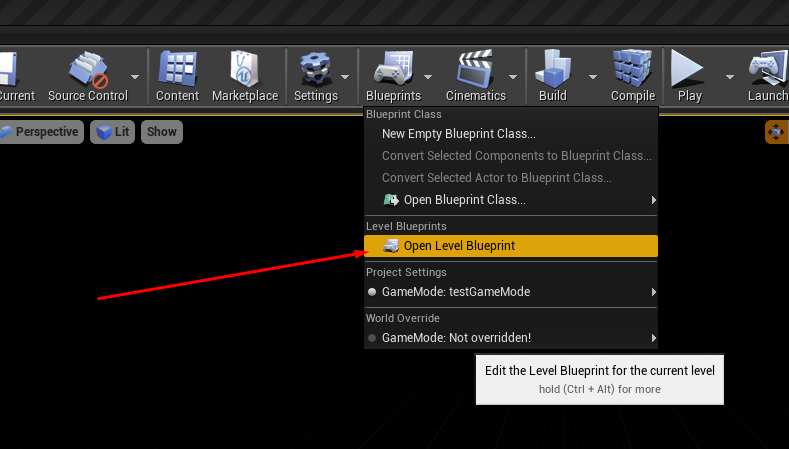

이 블루프린트에 **BeginPlay 이벤트** 에 **Open Level** 노드를 드래그합니다. **Level Name** 파라미터를 루프백 ip 주소 **127.0.0.1** 로 세팅합니다.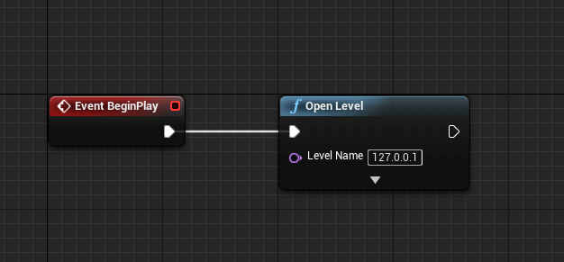

**컴파일** 후 **저장** 하고 블루프린트를 닫습니다.

마지막으로 **TestLevel** 레벨을 열고 레벨에 있는 기본 캐릭터를 클릭하고 서버에 접속할 때 캐릭터를 삭제합니다. 그렇지 않으면 캐릭터가 중복된 상태로 끝날 것입니다.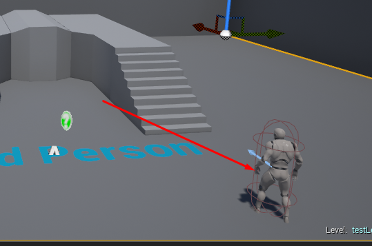

이제 프로젝트를 세팅해야 합니다.

아래와 같이

**세팅 -> 프로젝트 세팅** 으로 가서 **맵 & 모드** 로 갑니다.

**Editor Startup Map** 을 **EntryMap** 으로 설정합니다.

**Game Default Map** 을 **EntryMap** 으로 설정합니다.

**Transition Map** 을 **TransitionMap** 으로 설정합니다.

**Server Default Map** 을 **TestLevel** 으로 설정합니다.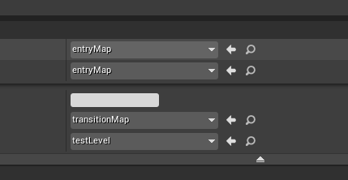


#### 8. 패키징 세팅 설정하기

**파일 -> 패키 프로젝트 -> 패키징 세팅** 으로 갑니다.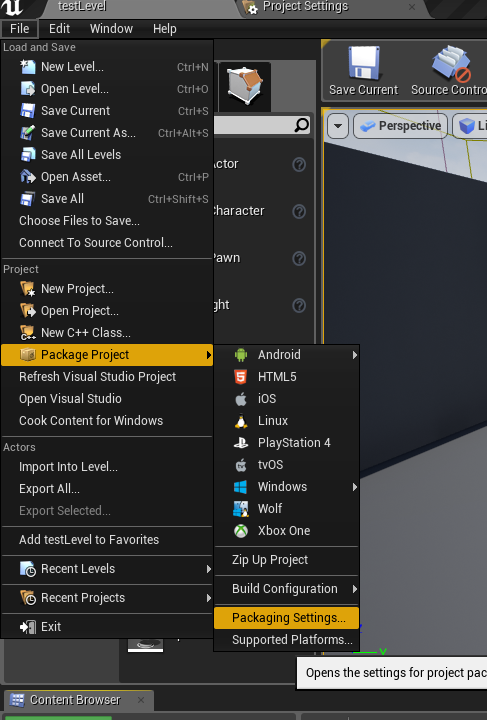

패키징 세팅에서 **List of maps to include in a packaged build** 를 찾을 때까지 스크롤을 내립니다. **+** 모양을 클릭하고 3개의 요소를 배열에 추가합니다. 그런 다음 **maps** 폴더로 이동하여 3개의 레벨 각각을 다음과 같이 배열에 추가합니다.

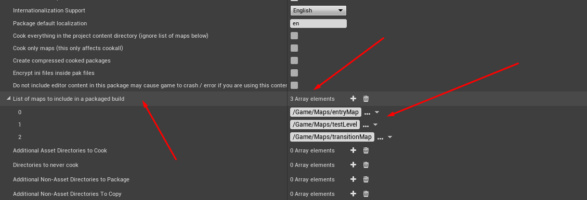

이제 세팅을 닫고 프로젝트를 패키징합니다. 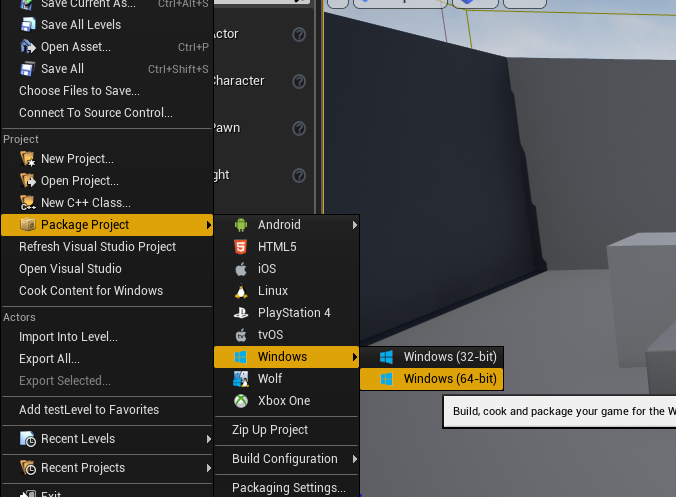


#### 9. 축하합니다 이제 프로젝트를 패키징했습니다 :D


## 세션 3 - 데디케이티드 서버 실행하고 접속하기

#### 1. 서버 실행파일 복사하기

프로젝트 폴더로 가서 **Binaries/Win64** 에서 **(프로젝트이름)Server.exe** 파일을 찾고 우클릭해서 복사합니다.

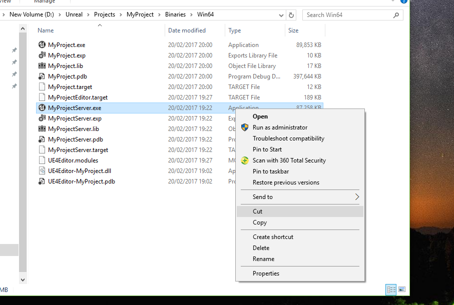

다음으로 **PackagedProjects/WindowsNoEditor** 이동합니다. 그런 다음 **(프로젝트이름)/Binaries/Win64** 로 가서  아래와 같이 전에 복사한 **server.exe** 파일을 붙여넣기 합니다.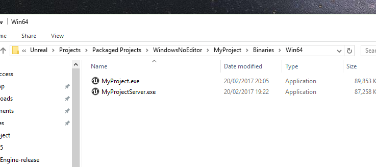


#### 2. 서버 바로가기 만들고 로그 옵션 세팅하기

이제 서버 파일을 가져와 바로가기를 만듭니다. 그런 다음 프로젝트 내부에서 설정한 레벨의 이름으로 변경합니다. 저의 경우 **TestLevel** 로 지었기 때문에 다음과 같이 바로가기를 만듭니다.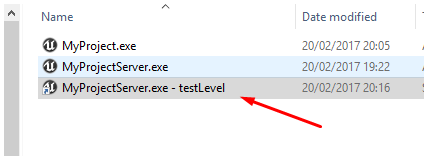

이제 이 바로가기를 우클릭하고 **속성** 으로 갑니다.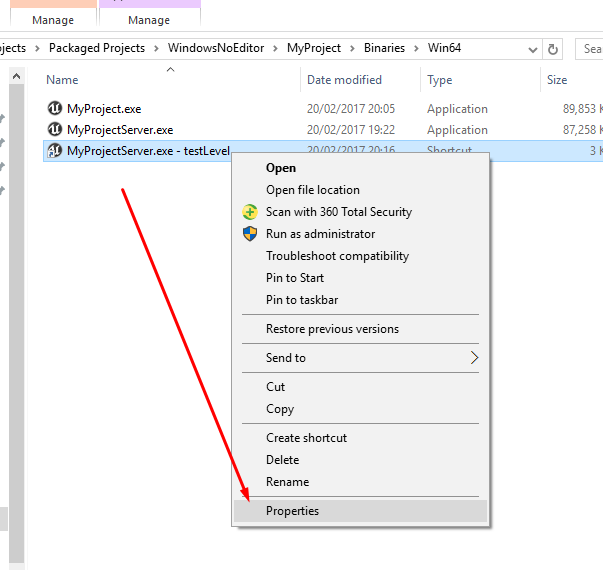


**대상** 의 마지막 경로에 아래와 같이 간단하게 **-log** 를 추가합니다.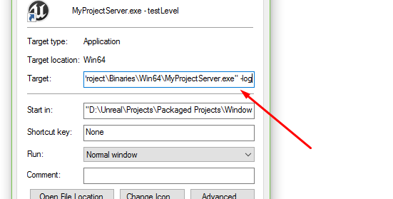

그리고 **확인** 을 클릭합니다.


#### 3. 서버 실행하고 테스트하기

이제 데디케이티드 서버와 테스트 레벨을 실행할 준비가 되었습니다.

방금 수정한 서버 바로가기를 더블클릭합니다.

실행이 잘 된다면 윈도우 콘솔이 열리고 서버가 자동으로 시작되는 것을 볼 수 있습니다.

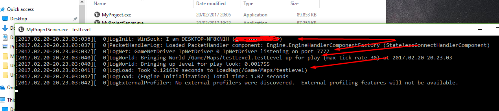

여기에서 서버를 호스팅하고 있는 서버의 ip주소를 볼 수 있으며, 서버가 언리얼 기본 포트인 7777포트에서 수신하고 있는 것을 볼 수 있습니다. 그리고 프로젝트에서 세팅한 대로 테스트 레벨이 로딩됩니다.

이제 서버가 실행 중이며 **project.exe** 를 클릭하여 서버에 접속하는 것만 남았습니다.

로그에서 정상적으로 가동되고 있다면 클라이언트가 서버에 접속을 요청한 다음 하단에 **Join succeeded: 256**  메시지를 볼 수 있을 것입니다. 

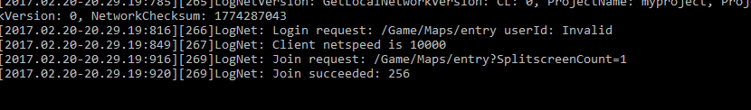

만약 다른 게임 실행파일을 실행했다면 아래와 같이 다른 로그인 성공이 뜬 것을 보실 수 있으며, 숫자가 **257** 이 된 것을 보실 수 있습니다.

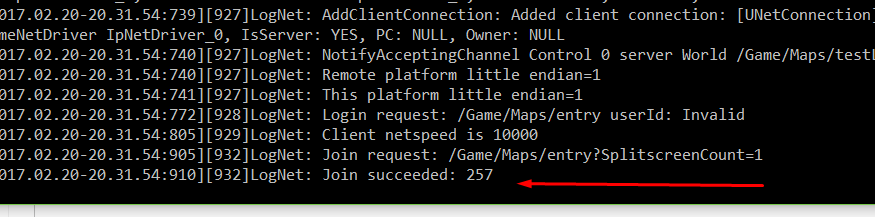

축하합니다 이제 컴퓨터에서 데디케이티드 서버를 호스팅 하고 있으며 움직일 수 있고 서로 볼 수 있는 두 명의 플레이어가 접속했습니다.

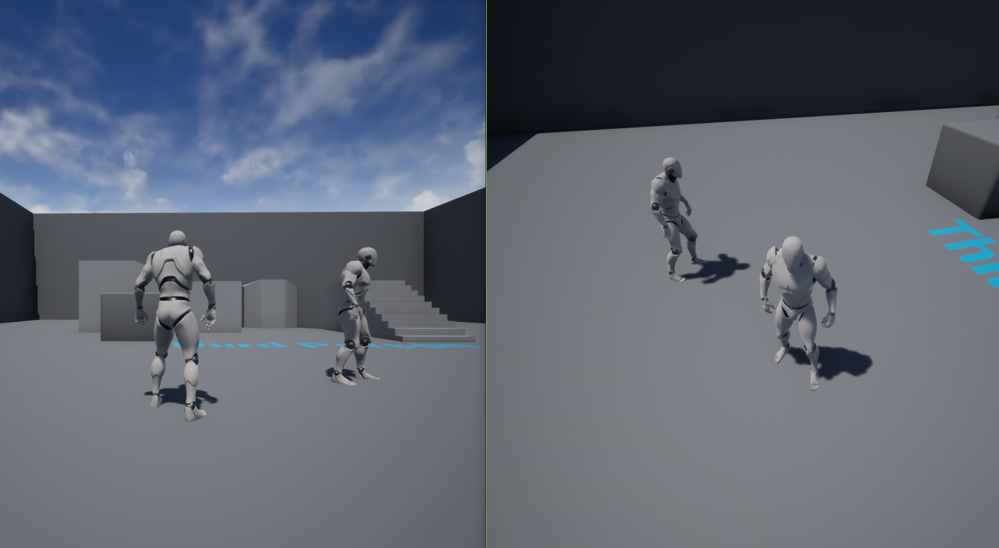

콘솔 창에서 서버를 올바르게 닫으려면 **ctrl + c** 를 누릅니다. 또는 콘솔 창 상단의 **X** 버튼을 누르거나 **ctrl + alt + delete** 를 누르고 실행 중인 언리얼 프로세스들을 종료하는 방법도 있습니다. 그러나 가장 좋은  방법은 **ctrl + c** 를 사용하는 것입니다.


## 세션 4 - 참고할 점

#### 1.  친구가 인터넷을 통해 접속할 수 있도록 하기

친구가 게임 등에 참여할 수 있도록 하려면 프로젝트에서 **EntryLevel** 로 들어간 다음, **레벨 블루프린트** 를 열고 **로컬 ip주소(127.0.0.1)** 대신 **실제 공용 ip주소** 를 입력합니다.

이 공용 ip 주소를 알아내려면 구글에 **"내 ip주소 확인법"** 이라고 치면 쉽게 찾을 수 있습니다. 또는 ip주소 찾기 프로그램 등을 사용하면 됩니다.

또한 **게임을 변경했을 때에는 반드시 게임을 다시 리패키징** 해야합니다. 따라서 ip주스를 실제 공용 ip 주소로 변경한 후에도 게임을 다시 리패키징해서 배포해야 합니다.

또한 Visual Studio에서도 서버 바이너리들을 리빌드 해야할 수도 있습니다.

패키징이 완료된 후 게임 폴더 에디터 전체를 보내지 말고 **.zip** 파일로 배포해야 합니다.

작업이 끝나면, 서버를 시작하고 친구들이 게임 실행 파일을 열고 게임에 참여하도록 합니다.

만약 친구들이 게임에 참여할 수 없다면 라우터에서 **포트 포워딩**을 하지 않았거나 **고정 ip 주소** 로 설정하지 않았기 때문일 것입니다.

<br />

#### 2. 가상 서버에서 호스팅하기

가상 서버에 로그인하고, 인터넷을 열어 게임 패키지를 다운로드합니다. 압축을 풀고 평소와 같이 서버 바로가기를 실행합니다.

<br />

#### 3. 추가 맵 제작 및 다른 맵에 접속하기

###### (사라진 것 같습니다.)

<br />

#### 4. 물리 활성화하기

###### (이전의 내용이 사라져서 이해하기 어렵다고 판단하여 번역하지 않았습니다.)

<br />

Details:

<https://answers.unrealengine.com/questions/97074/vehicle-template-issues-with-standalone-dedicated.html#answer-101321>

Commit that fixes this:

<https://github.com/EpicGames/UnrealEngine/commit/9860acf7b10c7187cc9287342e43c73b0083791f>

<br />

## 세션 5 - 편집자와 연락하는 법

도움이 필요하다면 언리얼 포럼에서 저를 찾을 수 있을 것입니다. <https://forums.unrealengine.com/member.php?42414-EniGmaa>

또는 unreal slackers 디스코드에서도 찾을 수 있습니다.  <http://unrealslackers.org/>

유저이름은 **PrintStringFTW#6597** 입니다.

감사합니다.

> 안녕하세요. 데디케이티드 서버 가이드 번역자입니다. 다른 언리얼 위키 문서도 하나씩 번역해나가 공유할 예정입니다. 
>
> 혹시나 번역해주었으면 하는 문서가 있거나 오타 또는 오역이 있다면, 제 GitHub 저장소에 이슈를 띄워주시기 바랍니다.
>
> 개인적인 문의 사항이 있다면 **bakjh.6280@gmail.com** 으로 이메일 보내주시기 바랍니다. 감사합니다.

<br />

## 세션 6 - 리눅스에서 언리얼 엔진 4 데디케이티드 서버 빌드 및 배치

원본 블로그 포스트: <http://blog.piinecone.com/post/98470361272/building-and-deploying-a-ue4-dedicated-server-for-linux>

이전 세션에서는 UE4 게임을 통해 Windows용 데디케이티드 서버 실행 파일을 구축하는 기본 사항들에 대해 다루었습니다. 이번 세션에서는 리눅스 바이너리의 패키징, 빌드, 그리고 배포에 대해 다룰 것입니다.

<br />

#### 1. 리눅스 크로스 컴파일을 위해 Visual Studio 설정하기

에픽 게임즈는 Windows에서 리눅스 바이너리를 빌드하기 위한 크로스 컴파일 도구 모음을 이미 제공했습니다.  다음 위키의 설치 가이드를 따라해 보시기 바랍니다. <https://wiki.unrealengine.com/Compiling_For_Linux>

도구 모음이 설치되면, 이를 가리키는 **LINUX_ROOT env** 변수가 있는지 확인합니다. **git bash** 를 켜고 다음 명령을 치면 확인할 수 있습니다. 

```SHELL
env | grep LINUX_ROOT
```

<br />

#### 2. 다른 위치에 프로젝트 패키징하기

Osman에게 이 문제를 지적해 준 것에 대해 감사를 표합니다. 독립 실행형 바이너리를 배포하고 실행하는 데 필요한 모든 것을 압축하기 위해서, 프로젝트의 작동 중인 디렉토리 외의 어떤 곳에서 프로젝트를 패키징 해야 할 것입니다. 결과 파일 구조에는 필수 요소들이 포함될 것입니다.

에디터를 열고 리눅스를 위한 프로젝트로 패키징합니다. 빌드의 다른 대상을 정합니다. (예: ~/Desktop/MyGameLinux/).

이 과정이 끝나면, 선택했던 경로에 리눅스 클라이언트 빌드를 볼 수 있을 것입니다.

<br />

#### 3. 리눅스 데디케이티드 서버 바이너리 빌드하기

